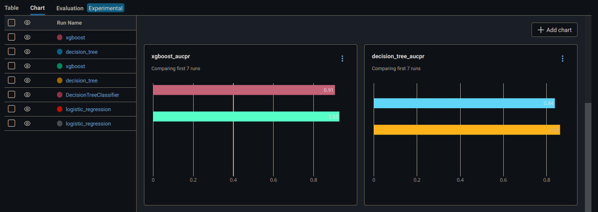

# Data and experiment tracking with DVC and mlFlow

This assignment is a part of the Applied ML course of my MSc. Data Science Program at Chennai Mathematical Institute.

## Problem statement

Assignment 2: Experiment Tracking [due 20 Feb 2024]

1. **Data version control**  
In `prepare.ipynb` track the versions of data using dvc
load the raw data into `raw_data.csv` and save the split data into `train.csv`/`validation.csv`/`test.csv`
   - update train/validation/test split by choosing different random seed
   - checkout the first version (before update) using dvc and print the distribution of target variable (number of 0s and number of 1s) in `train.csv`, `validation.csv`, and `test.csv`
    - checkout the updated version using dvc and print the distribution of target variable in `train.csv`, `validation.csv`, `test.csv`
   - **bonus**: (decouple compute and storage) track the data versions using google drive as storage
2. **Model version control and experiment tracking**  
    - in train.ipynb track the experiments and model versions using mlflow
    - build, track, and register 3 benchmark models using MLflow
checkout and print AUCPR for each of the three benchmark models

## Solution

Overview of mlflow runs

Comparing mlflow runs
